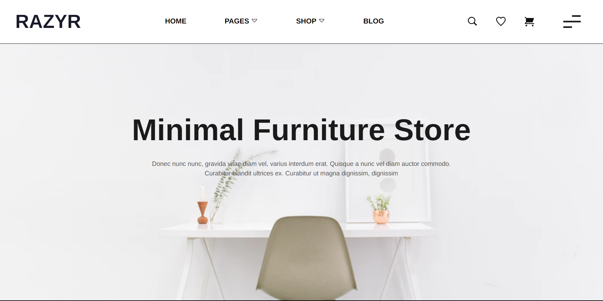
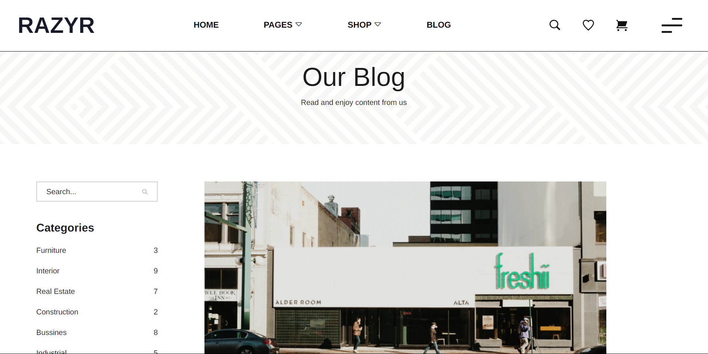
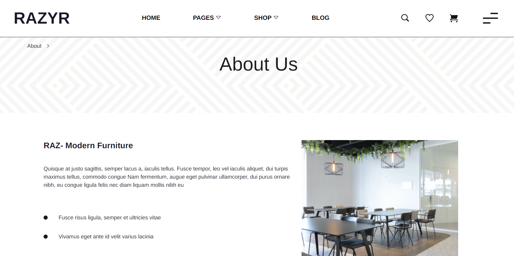
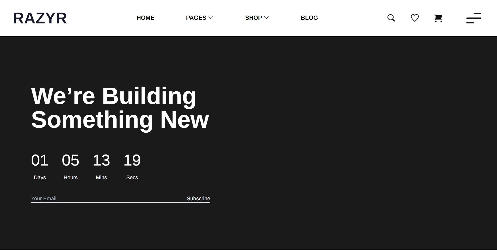

<!-- # Getting Started with Create React App

This project was bootstrapped with [Create React App](https://github.com/facebook/create-react-app).

## Available Scripts

In the project directory, you can run:

### `npm start`

Runs the app in the development mode.\
Open [http://localhost:3000](http://localhost:3000) to view it in your browser.

The page will reload when you make changes.\
You may also see any lint errors in the console.

### `npm test`

Launches the test runner in the interactive watch mode.\
See the section about [running tests](https://facebook.github.io/create-react-app/docs/running-tests) for more information.

### `npm run build`

Builds the app for production to the `build` folder.\
It correctly bundles React in production mode and optimizes the build for the best performance.

The build is minified and the filenames include the hashes.\
Your app is ready to be deployed!

See the section about [deployment](https://facebook.github.io/create-react-app/docs/deployment) for more information.

### `npm run eject`

**Note: this is a one-way operation. Once you `eject`, you can't go back!**

If you aren't satisfied with the build tool and configuration choices, you can `eject` at any time. This command will remove the single build dependency from your project.

Instead, it will copy all the configuration files and the transitive dependencies (webpack, Babel, ESLint, etc) right into your project so you have full control over them. All of the commands except `eject` will still work, but they will point to the copied scripts so you can tweak them. At this point you're on your own.

You don't have to ever use `eject`. The curated feature set is suitable for small and middle deployments, and you shouldn't feel obligated to use this feature. However we understand that this tool wouldn't be useful if you couldn't customize it when you are ready for it.

## Learn More

You can learn more in the [Create React App documentation](https://facebook.github.io/create-react-app/docs/getting-started).

To learn React, check out the [React documentation](https://reactjs.org/).

### Code Splitting

This section has moved here: [https://facebook.github.io/create-react-app/docs/code-splitting](https://facebook.github.io/create-react-app/docs/code-splitting)

### Analyzing the Bundle Size

This section has moved here: [https://facebook.github.io/create-react-app/docs/analyzing-the-bundle-size](https://facebook.github.io/create-react-app/docs/analyzing-the-bundle-size)

### Making a Progressive Web App

This section has moved here: [https://facebook.github.io/create-react-app/docs/making-a-progressive-web-app](https://facebook.github.io/create-react-app/docs/making-a-progressive-web-app)

### Advanced Configuration

This section has moved here: [https://facebook.github.io/create-react-app/docs/advanced-configuration](https://facebook.github.io/create-react-app/docs/advanced-configuration)

### Deployment

This section has moved here: [https://facebook.github.io/create-react-app/docs/deployment](https://facebook.github.io/create-react-app/docs/deployment)

### `npm run build` fails to minify

This section has moved here: [https://facebook.github.io/create-react-app/docs/troubleshooting#npm-run-build-fails-to-minify](https://facebook.github.io/create-react-app/docs/troubleshooting#npm-run-build-fails-to-minify)
 -->

<!-- # Getting Started with Create React App

This project was bootstrapped with [Create React App](https://github.com/facebook/create-react-app).

## Available Scripts

In the project directory, you can run:

### `npm start`

Runs the app in the development mode.\
Open [http://localhost:3000](http://localhost:3000) to view it in your browser.

The page will reload when you make changes.\
You may also see any lint errors in the console.

### `npm test`

Launches the test runner in the interactive watch mode.\
See the section about [running tests](https://facebook.github.io/create-react-app/docs/running-tests) for more information.

### `npm run build`

Builds the app for production to the `build` folder.\
It correctly bundles React in production mode and optimizes the build for the best performance.

The build is minified and the filenames include the hashes.\
Your app is ready to be deployed!

See the section about [deployment](https://facebook.github.io/create-react-app/docs/deployment) for more information.

### `npm run eject`

**Note: this is a one-way operation. Once you `eject`, you can't go back!**

If you aren't satisfied with the build tool and configuration choices, you can `eject` at any time. This command will remove the single build dependency from your project.

Instead, it will copy all the configuration files and the transitive dependencies (webpack, Babel, ESLint, etc) right into your project so you have full control over them. All of the commands except `eject` will still work, but they will point to the copied scripts so you can tweak them. At this point you're on your own.

You don't have to ever use `eject`. The curated feature set is suitable for small and middle deployments, and you shouldn't feel obligated to use this feature. However we understand that this tool wouldn't be useful if you couldn't customize it when you are ready for it.

## Learn More

You can learn more in the [Create React App documentation](https://facebook.github.io/create-react-app/docs/getting-started).

To learn React, check out the [React documentation](https://reactjs.org/).

### Code Splitting

This section has moved here: [https://facebook.github.io/create-react-app/docs/code-splitting](https://facebook.github.io/create-react-app/docs/code-splitting)

### Analyzing the Bundle Size

This section has moved here: [https://facebook.github.io/create-react-app/docs/analyzing-the-bundle-size](https://facebook.github.io/create-react-app/docs/analyzing-the-bundle-size)

### Making a Progressive Web App

This section has moved here: [https://facebook.github.io/create-react-app/docs/making-a-progressive-web-app](https://facebook.github.io/create-react-app/docs/making-a-progressive-web-app)

### Advanced Configuration

This section has moved here: [https://facebook.github.io/create-react-app/docs/advanced-configuration](https://facebook.github.io/create-react-app/docs/advanced-configuration)

### Deployment

This section has moved here: [https://facebook.github.io/create-react-app/docs/deployment](https://facebook.github.io/create-react-app/docs/deployment)

### `npm run build` fails to minify

This section has moved here: [https://facebook.github.io/create-react-app/docs/troubleshooting#npm-run-build-fails-to-minify](https://facebook.github.io/create-react-app/docs/troubleshooting#npm-run-build-fails-to-minify) -->

<a id="readme-top"></a>

<!-- PROJECT LOGO -->
<br />
<div align="center">
  <a href="#">
    
  </a>

  <h2 align="center">RAZYR FURNITURE</h2>

  <p align="center">
    <a href="https://razyr-store.vercel.app/">View Demo</a>
    ·
    <a href="https://github.com/teamNgabuburide/ngabuburide-frontend/issues">Report Bug</a>
    ·
    <a href="https://github.com/teamNgabuburide/ngabuburide-frontend/pulls">Request Feature</a>
  </p>
</div>

## Built With

<p align="center">
  <a href="https://skillicons.dev">
    
  </a>
</p>

<p align="right">(<a href="#readme-top">back to top</a>)</p>

<!-- ABOUT THE PROJECT -->

# About The Project

### Built With

- [![React][React.js]][React-url]
- [![Tailwind][Tailwind-CSS]][Tailwind-url]
- [![Redux][Redux]][Redux-url]

<p align="right">(<a href="#readme-top">back to top</a>)</p>

## Features

### Customer

- Auth
  - Login
  - Logout
- User
  - Register
  - Forgot Password
  - Edit Profile
- Product
- Transaction

### Seller

- Auth
  - Login
  - Logout
- User
  - Register
  - Forgot Password
  - Edit Profile
- Product
  - Add Product
  - Edit Product
- Transaction

<!-- GETTING STARTED -->
<!-- # Getting Started -->

<!--
 ## Prerequisites
-->

## How to Run the Application

<!-- ## Installation -->

### 1. Clone this repository

Clone this repository by run the following code:

```
$ git clone <this-repo-url>
```

### 2. Install dependency packages

Install dependency packages by run the following code inside project folder:

```
$ npm install
```

### 3. Configure .env file

Configure .env file by create file named .env inside project folder and add this line to the file:

```
NEXT_PUBLIC_BACKEND_URL = "https://ngabuburide-be.vercel.app"
```

### 4. Run projects

Run this projects by run the following code:

```
$ npm start
```

It runs the app in the development mode.\
Open [local host](http://localhost:3000) to view it in your browser.

The page will reload when you make changes.\
You may also see any lint errors in the console.

<p align="right">(<a href="#readme-top">back to top</a>)</p>

<!-- USAGE -->
<!--
# Usage

## npm start

Runs the app in the development mode. Open [http://localhost:3000](http://localhost:3000) to view it in your browser.

The page will reload when you make changes. You may also see any lint errors in the console.

## npm test

Launches the test runner in the interactive watch mode. See the section about [running tests](https://facebook.github.io/create-react-app/docs/running-tests) for more information.

## npm run eject

**Note: this is a one-way operation. Once you `eject`, you can't go back!**

If you aren't satisfied with the build tool and configuration choices, you can `eject` at any time. This command will remove the single build dependency from your project.
-->

<!-- ROADMAP -->
<!-- # Roadmap
<!--
- [x] Add Changelog
- [x] Add back to top links
- [ ] Add Additional Templates w/ Examples
- [ ] Add "components" document to easily copy & paste sections of the readme
- [ ] Multi-language Support
    - [ ] Chinese
    - [ ] Spanish -->

<!-- <p align="right">(<a href="#readme-top">back to top</a>)</p> -->

<!-- CONTRIBUTING -->

## Contributing

1. Fork the Project
2. Create your new Branch ( `git checkout -b ...` )
3. Commit your Changes ( `git commit -m '...'` )
4. Push to the Branch ( `git push origin ...` )
5. Open a Pull Request

<p align="right">(<a href="#readme-top">back to top</a>)</p>

## Deployment

[Vercel deploy Link](https://razyr-store.vercel.app/)

<p align="right">(<a href="#readme-top">back to top</a>)</p>

## Documentation

<div>
  
  
</div>
<div>
  
  
</div>

## Related Projects

[Razyr Furniture Backend](https://github.com/teamNgabuburide/ngabuburide-be)

<p align="right">(<a href="#readme-top">back to top</a>)</p>

## Contributors

<center>
  <table>
    <tr>
      <td align="center">
        <a href="https://github.com/afif-buchori">
          <br/>
          <sub><b>M Afif Buchori</b></sub>
        </a>
      </td>
        <td align="center">
        <a href="https://github.com/zikriaulia28">
          <br/>
          <sub><b>Zikri Aulia</b></sub>
        </a>
        </td>
        <td align="center">
        <a href="https://github.com/yanu-setiawan?">
          <br/>
          <sub><b>Yanu Setiawan</b></sub>
        </a>
        </td>
        <td align="center">
        <a href="https://github.com/redhadefinto">
          <br/>
          <sub><b>Redha Definto</b></sub>
        </a>
        </td>
        <td align="center">
        <a href="https://github.com/abdulrosid21">
          <br/>
          <sub><b>Abdul Latif Rosid</b></sub>
        </a>
        </td>
  </table>
</center>

<!-- <p align="right">(<a href="#readme-top">back to top</a>)</p> -->

<!-- CONTACT -->
<!-- # Contact

Your Name - []() -->

<!-- <p align="right">(<a href="#readme-top">back to top</a>)</p> -->

<p align="center"> <samp><i>&copy; 2023 TeamNgabuburide </i></samp> </p>

[React.js]: https://img.shields.io/badge/React-20232A?style=for-the-badge&logo=react&logoColor=61DAFB
[React-url]: https://reactjs.org/
[Tailwind-CSS]: https://img.shields.io/badge/tailwindcss-%2338B2AC.svg?style=for-the-badge&logo=tailwind-css&logoColor=white
[Tailwind-url]: https://tailwindcss.com/
[Redux]: https://img.shields.io/badge/redux-%23593d88.svg?style=for-the-badge&logo=redux&logoColor=white
[Redux-url]: https://redux.js.org/
